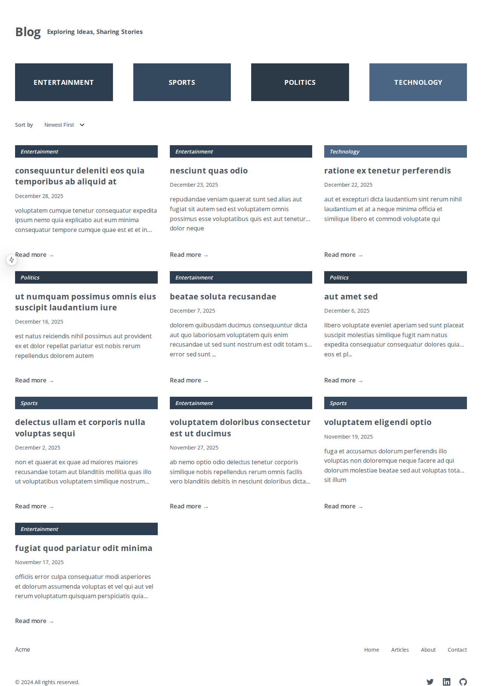

# Next.js Simple blog 🚀

A high-performance, type-safe blog platform built with modern web technologies. Features article management, categorization, and a beautiful responsive UI.




## ✨ Features

- **Modern Tech Stack**: Built with Next.js 15, React 19, and TypeScript for robust type safety
- **Beautiful UI Components**: Clean and responsive design with modern React patterns
- **Type-Safe API Layer**: Using DTOs for reliable data transfer
- **Responsive Design**: Perfect viewing experience across all devices
- **Testing Suite**: Comprehensive unit and E2E testing with Jest and Playwright

## 🚀 Quick Start

1. Clone the repository
2. Install dependencies:

```bash
npm install
# or
yarn install
# or
pnpm install
# or
bun install
```

3. Run the development server:

```bash
npm run dev
# or
yarn dev
# or
pnpm dev
# or
bun dev
```

4. Open [http://localhost:3000](http://localhost:3000) to view the application

## 🧪 Testing

This project includes both unit and end-to-end tests:

- **Unit Tests**: Run `npm test` to execute Jest unit tests
- **E2E Tests**: Run `npm run test:e2e` to execute Playwright end-to-end tests

For more details about testing, check out [TESTING.md](TESTING.md).

## 📁 Project Structure

```
src/
├── app/              # Next.js app directory and pages
├── components/       # Reusable React components
├── lib/             # Utilities, services, and configuration
│   ├── api/         # API integration
│   ├── config/      # Application configuration
│   ├── services/    # Business logic services
│   ├── types/       # TypeScript types and DTOs
│   └── helpers/     # Utility functions
└── tests/           # Test configuration and helpers
```

## 🎯 Key Features

- **Article Management**
  - Categorize articles for better organization
  - Sort and filter capabilities

- **User Experience**
  - Fast page loads with Next.js optimizations
  - Responsive design for all screen sizes
  - Beautiful typography with optimized fonts

- **Developer Experience**
  - Type-safe development with TypeScript
  - Comprehensive testing suite
  - Modern tooling and best practices

## 📚 Learn More

- [Next.js Documentation](https://nextjs.org/docs) - Next.js features and API
- [React Documentation](https://react.dev) - Learn React
- [TypeScript](https://www.typescriptlang.org) - TypeScript documentation

## 📝 License

This project is licensed under the MIT License - see the [LICENSE](LICENSE) file for details.
